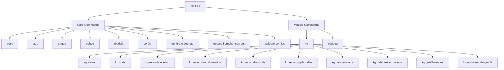

# CLI Commands

The LOCAL-LLM-STACK-RELOADED project provides a comprehensive command-line interface (CLI) for managing the stack, its components, and modules. This document provides detailed information about the available commands, their options, and usage examples.

## Overview

The CLI is implemented in Python using the Click library and serves as a replacement for the original Bash-based CLI. It provides commands for:

- Starting and stopping the stack and its components
- Managing models
- Configuring the stack
- Generating and managing secrets
- Interacting with the Knowledge Graph
- Running code quality checks

## Architecture



## Core Commands

### `llm`

The main command for the LLM Stack CLI.

```bash
llm [OPTIONS] COMMAND [ARGS]...
```

**Options:**
- `--version`: Show the version and exit.
- `-h, --help`: Show help message and exit.

### `llm start`

Start the stack or specific components.

```bash
llm start [OPTIONS] [COMPONENT]
```

**Arguments:**
- `COMPONENT`: Name of the component to start (e.g., ollama, librechat). If not specified, all components will be started.

**Options:**
- `--with MODULE`: Module to start along with the core components.

**Examples:**
```bash
# Start all components
llm start

# Start only the Ollama component
llm start ollama

# Start core components with the knowledge graph module
llm start --with knowledge_graph
```

### `llm stop`

Stop the stack or specific components.

```bash
llm stop [OPTIONS] [COMPONENT]
```

**Arguments:**
- `COMPONENT`: Name of the component to stop (e.g., ollama, librechat). If not specified, all components will be stopped.

**Options:**
- `--with MODULE`: Module to stop along with the core components.

**Examples:**
```bash
# Stop all components
llm stop

# Stop only the Ollama component
llm stop ollama

# Stop core components and the knowledge graph module
llm stop --with knowledge_graph
```

### `llm status`

Display the status of all components.

```bash
llm status
```

**Examples:**
```bash
# Check status of all components
llm status
```

### `llm debug`

Start components in debug mode.

```bash
llm debug [COMPONENT]
```

**Arguments:**
- `COMPONENT`: Name of the component to debug (currently only 'librechat' is supported). If not specified, all components will be started in debug mode.

**Examples:**
```bash
# Start all components in debug mode
llm debug

# Start LibreChat in debug mode
llm debug librechat
```

### `llm models`

Manage models.

```bash
llm models [OPTIONS] ACTION [MODEL]
```

**Arguments:**
- `ACTION`: The action to perform (list, add, remove).
- `MODEL`: The name of the model (required for add and remove actions).

**Examples:**
```bash
# List all models
llm models list

# Add a model
llm models add llama2

# Remove a model
llm models remove llama2
```

### `llm config`

Show or edit the configuration.

```bash
llm config ACTION
```

**Arguments:**
- `ACTION`: The action to perform (show, edit).

**Examples:**
```bash
# Show the configuration
llm config show

# Edit the configuration
llm config edit
```

### `llm generate-secrets`

Generate secure secrets for the configuration.

```bash
llm generate-secrets
```

**Examples:**
```bash
# Generate secure secrets
llm generate-secrets
```

### `llm update-librechat-secrets`

Update LibreChat secrets from the main configuration.

```bash
llm update-librechat-secrets
```

**Examples:**
```bash
# Update LibreChat secrets
llm update-librechat-secrets
```

### `llm validate-configs`

Validate all configuration files.

```bash
llm validate-configs
```

**Examples:**
```bash
# Validate all configuration files
llm validate-configs
```

## Knowledge Graph Commands

The Knowledge Graph module provides CLI commands for interacting with the Knowledge Graph.

### `llm kg status`

Display the status of the Knowledge Graph Module.

```bash
llm kg status
```

**Examples:**
```bash
# Check status of the Knowledge Graph module
llm kg status
```

### `llm kg stats`

Display migration statistics.

```bash
llm kg stats
```

**Examples:**
```bash
# Show migration statistics
llm kg stats
```

### `llm kg record-decision`

Record a migration decision.

```bash
llm kg record-decision [OPTIONS]
```

**Options:**
- `--decision TEXT`: The decision made (required).
- `--rationale TEXT`: Justification for the decision (required).
- `--bash-file TEXT`: Path to the Bash file.
- `--python-file TEXT`: Path to the Python file.
- `--alternatives TEXT`: Alternative decisions (comma-separated).
- `--impact TEXT`: Impact of the decision.

**Examples:**
```bash
# Record a migration decision
llm kg record-decision \
  --decision "Migrate function X to Python" \
  --rationale "Better readability and maintainability" \
  --bash-file "path/to/bash/file.sh" \
  --python-file "path/to/python/file.py" \
  --alternatives "Keep as Bash, Rewrite in Go" \
  --impact "Improved maintainability and integration with other Python code"
```

### `llm kg record-transformation`

Record a code transformation.

```bash
llm kg record-transformation [OPTIONS]
```

**Options:**
- `--type TEXT`: Type of transformation (required).
- `--before TEXT`: Code before the transformation (required).
- `--after TEXT`: Code after the transformation (required).
- `--bash-file TEXT`: Path to the Bash file.
- `--python-file TEXT`: Path to the Python file.
- `--decision-id TEXT`: ID of the associated migration decision.

**Examples:**
```bash
# Record a code transformation
llm kg record-transformation \
  --type "function_migration" \
  --before "bash_code_here" \
  --after "python_code_here" \
  --bash-file "path/to/bash/file.sh" \
  --python-file "path/to/python/file.py"
```

### `llm kg record-bash-file`

Record a Bash file.

```bash
llm kg record-bash-file [OPTIONS]
```

**Options:**
- `--file-path TEXT`: Path to the Bash file (required).
- `--content-file TEXT`: Path to the file with the content.
- `--content TEXT`: Content of the Bash file.

**Examples:**
```bash
# Record a Bash file with content from a file
llm kg record-bash-file \
  --file-path "path/to/bash/file.sh" \
  --content-file "path/to/content/file.sh"

# Record a Bash file with inline content
llm kg record-bash-file \
  --file-path "path/to/bash/file.sh" \
  --content "bash_content_here"
```

### `llm kg record-python-file`

Record a Python file.

```bash
llm kg record-python-file [OPTIONS]
```

**Options:**
- `--file-path TEXT`: Path to the Python file (required).
- `--content-file TEXT`: Path to the file with the content.
- `--content TEXT`: Content of the Python file.
- `--bash-file TEXT`: Path to the corresponding Bash file.

**Examples:**
```bash
# Record a Python file with content from a file
llm kg record-python-file \
  --file-path "path/to/python/file.py" \
  --content-file "path/to/content/file.py" \
  --bash-file "path/to/bash/file.sh"

# Record a Python file with inline content
llm kg record-python-file \
  --file-path "path/to/python/file.py" \
  --content "python_content_here" \
  --bash-file "path/to/bash/file.sh"
```

### `llm kg get-decisions`

Get migration decisions.

```bash
llm kg get-decisions [OPTIONS]
```

**Options:**
- `--bash-file TEXT`: Path to the Bash file.
- `--python-file TEXT`: Path to the Python file.

**Examples:**
```bash
# Get all migration decisions
llm kg get-decisions

# Get migration decisions for a specific Bash file
llm kg get-decisions --bash-file "path/to/bash/file.sh"

# Get migration decisions for a specific Python file
llm kg get-decisions --python-file "path/to/python/file.py"
```

### `llm kg get-transformations`

Get code transformations.

```bash
llm kg get-transformations [OPTIONS]
```

**Options:**
- `--bash-file TEXT`: Path to the Bash file.
- `--python-file TEXT`: Path to the Python file.
- `--type TEXT`: Type of transformation.

**Examples:**
```bash
# Get all code transformations
llm kg get-transformations

# Get code transformations for a specific Bash file
llm kg get-transformations --bash-file "path/to/bash/file.sh"

# Get code transformations for a specific Python file
llm kg get-transformations --python-file "path/to/python/file.py"

# Get code transformations of a specific type
llm kg get-transformations --type "function_migration"
```

### `llm kg get-file-status`

Get the migration status of a file.

```bash
llm kg get-file-status [OPTIONS]
```

**Options:**
- `--bash-file TEXT`: Path to the Bash file (required).

**Examples:**
```bash
# Get the migration status of a Bash file
llm kg get-file-status --bash-file "path/to/bash/file.sh"
```

### `llm kg update-code-graph`

Update the knowledge graph with code structure from Python files.

```bash
llm kg update-code-graph [OPTIONS]
```

**Options:**
- `--path, -p TEXT`: Path to the codebase to scan (default: ".").
- `--verbose, -v`: Enable verbose output.

**Examples:**
```bash
# Update the code graph from the current directory
llm kg update-code-graph

# Update the code graph from a specific directory with verbose output
llm kg update-code-graph --path "path/to/codebase" --verbose
```

## Code Quality Commands

The Code Quality module provides CLI commands for running code quality checks.

### `llm codeqa`

Code Quality commands.

```bash
llm codeqa [OPTIONS] COMMAND [ARGS]...
```

**Examples:**
```bash
# Show help for code quality commands
llm codeqa --help
```

## Best Practices

When using the CLI, follow these best practices:

1. **Use the `status` command**: Before starting or stopping components, use the `status` command to check the current state of the stack.

2. **Generate secrets**: Before starting the stack for the first time, use the `generate-secrets` command to generate secure secrets.

3. **Validate configuration**: After making changes to the configuration, use the `validate-configs` command to ensure the configuration is valid.

4. **Use modules**: When working with specific modules like the Knowledge Graph, use the module-specific commands to interact with them.

5. **Record decisions and transformations**: When migrating code, use the Knowledge Graph commands to record decisions and transformations for better traceability.

## Troubleshooting

If you encounter issues with the CLI, try the following:

1. **Check component status**: Use the `status` command to check if all components are running.

2. **Validate configuration**: Use the `validate-configs` command to ensure the configuration is valid.

3. **Check logs**: Look for error messages in the console output.

4. **Restart components**: Try stopping and starting the components that are causing issues.

5. **Generate new secrets**: If authentication issues occur, try generating new secrets with the `generate-secrets` command.