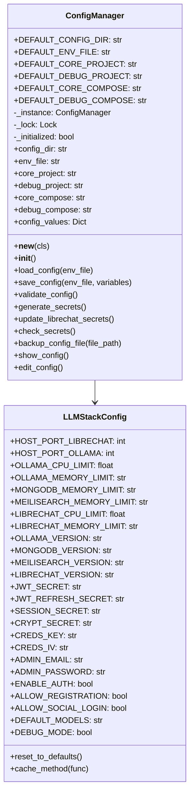

# Configuration Module

The configuration module (`llm_stack.core.config`) provides functions for loading, validating, and managing the configuration for the LOCAL-LLM-STACK-RELOADED project.

## Overview

The configuration module is responsible for:

1. Loading and saving configuration from .env files
2. Validating configuration values
3. Generating and managing secure secrets
4. Managing LibreChat secrets
5. Creating backups of configuration files

The module implements a singleton `ConfigManager` class to maintain configuration state and provides module-level functions for backward compatibility.

## Architecture



## ConfigManager Class

The `ConfigManager` class implements a singleton pattern to maintain configuration state across the application. It provides methods for loading, saving, validating, and managing configuration values, as well as generating and managing secure secrets.

### Key Methods

#### `load_config(env_file: Optional[str] = None) -> bool`

Loads configuration values from an environment file and exports them to the environment.

**Parameters:**
- `env_file`: Path to the .env file (defaults to the configured env_file)

**Returns:**
- `bool`: True if the configuration was successfully loaded, False otherwise

**Example:**
```python
from llm_stack.core import config

# Load configuration from default .env file
config_manager = config.get_config_manager()
if config_manager.load_config():
    print("Configuration loaded successfully")
else:
    print("Failed to load configuration")
    
# Load configuration from a specific file
if config_manager.load_config("custom/.env"):
    print("Custom configuration loaded successfully")
```

#### `save_config(env_file: Optional[str] = None, variables: Optional[List[Tuple[str, str]]] = None) -> bool`

Saves configuration values to an environment file.

**Parameters:**
- `env_file`: Path to the .env file (defaults to the configured env_file)
- `variables`: List of (key, value) tuples to be saved

**Returns:**
- `bool`: True if the configuration was successfully saved, False otherwise

**Example:**
```python
from llm_stack.core import config

variables = [
    ("HOST_PORT_OLLAMA", "11434"),
    ("HOST_PORT_LIBRECHAT", "3080")
]
if config.save_config("config/.env", variables):
    print("Configuration saved successfully")
else:
    print("Failed to save configuration")
```

#### `validate_config() -> bool`

Validates the configuration by checking if required configuration files exist, if port configurations are valid numbers, if resource limitations are valid, and if security settings are set.

**Returns:**
- `bool`: True if the configuration is valid, False otherwise

**Example:**
```python
from llm_stack.core import config

if config.validate_config():
    print("Configuration is valid")
else:
    print("Configuration is invalid")
```

#### `generate_secrets() -> bool`

Generates cryptographically secure random secrets for the configuration, including JWT secrets, session secrets, and admin password.

**Returns:**
- `bool`: True if the secrets were successfully generated, False otherwise

**Example:**
```python
from llm_stack.core import config

if config.generate_secrets():
    print("Secrets generated successfully")
else:
    print("Failed to generate secrets")
```

#### `update_librechat_secrets() -> bool`

Updates LibreChat secrets from the main configuration.

**Returns:**
- `bool`: True if the secrets were successfully updated, False otherwise

**Example:**
```python
from llm_stack.core import config

if config.update_librechat_secrets():
    print("LibreChat secrets updated successfully")
else:
    print("Failed to update LibreChat secrets")
```

#### `check_secrets() -> bool`

Checks if the required secrets are set in the configuration and generates them if needed.

**Returns:**
- `bool`: True if all required secrets are set, False otherwise

**Example:**
```python
from llm_stack.core import config

if config.check_secrets():
    print("All required secrets are set")
else:
    print("Some required secrets are not set")
```

#### `backup_config_file(file_path: Optional[str] = None) -> Optional[str]`

Creates a backup of a configuration file with a timestamp in the filename.

**Parameters:**
- `file_path`: Path to the configuration file (defaults to the configured env_file)

**Returns:**
- `Optional[str]`: Path to the backup file or None if an error occurred

**Example:**
```python
from llm_stack.core import config

backup_path = config.backup_config_file("config/.env")
if backup_path:
    print(f"Backup created at {backup_path}")
else:
    print("Failed to create backup")
```

## LLMStackConfig Class

The `LLMStackConfig` class is a Pydantic model that defines the configuration schema for the LLM Stack, including default values and descriptions for each configuration parameter.

### Key Attributes

- `HOST_PORT_LIBRECHAT`: Port for LibreChat (default: 3080)
- `HOST_PORT_OLLAMA`: Port for Ollama (default: 11434)
- `OLLAMA_CPU_LIMIT`: CPU limit for Ollama (default: 0.75)
- `OLLAMA_MEMORY_LIMIT`: Memory limit for Ollama (default: "16G")
- `MONGODB_MEMORY_LIMIT`: Memory limit for MongoDB (default: "2G")
- `MEILISEARCH_MEMORY_LIMIT`: Memory limit for Meilisearch (default: "1G")
- `LIBRECHAT_CPU_LIMIT`: CPU limit for LibreChat (default: 0.50)
- `LIBRECHAT_MEMORY_LIMIT`: Memory limit for LibreChat (default: "4G")
- `OLLAMA_VERSION`: Ollama version (default: "0.1.27")
- `MONGODB_VERSION`: MongoDB version (default: "6.0.6")
- `MEILISEARCH_VERSION`: Meilisearch version (default: "latest")
- `LIBRECHAT_VERSION`: LibreChat version (default: "latest")
- `JWT_SECRET`: JWT secret for LibreChat (default: "")
- `JWT_REFRESH_SECRET`: JWT refresh secret for LibreChat (default: "")
- `SESSION_SECRET`: Session secret for LibreChat (default: "")
- `CRYPT_SECRET`: Encryption secret for LibreChat (default: "")
- `CREDS_KEY`: Credentials key for LibreChat (default: "")
- `CREDS_IV`: Credentials IV for LibreChat (default: "")
- `ADMIN_EMAIL`: Admin email for LibreChat (default: "admin@local.host")
- `ADMIN_PASSWORD`: Admin password for LibreChat (default: "")
- `ENABLE_AUTH`: Enable authentication (default: True)
- `ALLOW_REGISTRATION`: Allow registration (default: True)
- `ALLOW_SOCIAL_LOGIN`: Allow social login (default: False)
- `DEFAULT_MODELS`: Default models for Ollama (default: "tinyllama")
- `DEBUG_MODE`: Enable debug mode (default: False)

## Module-Level Functions

The configuration module provides module-level functions that wrap the `ConfigManager` methods for backward compatibility.

### Key Functions

#### `get_config_manager() -> ConfigManager`

Gets the singleton instance of the `ConfigManager` class.

**Returns:**
- `ConfigManager`: The configuration manager instance

**Example:**
```python
from llm_stack.core.config import get_config_manager

config_manager = get_config_manager()
config_manager.load_config()
```

#### `init_config() -> None`

Initializes the configuration with default values by calling the `reset_to_defaults` method of the `ConfigManager`.

**Example:**
```python
from llm_stack.core.config import init_config

init_config()
```

#### `load_config(env_file: Optional[str] = None) -> bool`

Loads configuration values from an environment file and exports them to the environment.

**Parameters:**
- `env_file`: Path to the .env file (defaults to the configured env_file)

**Returns:**
- `bool`: True if the configuration was successfully loaded, False otherwise

**Example:**
```python
from llm_stack.core import config

if config.load_config("config/.env"):
    print("Configuration loaded successfully")
else:
    print("Failed to load configuration")
```

#### `get_config(key: str, default_value: str = "") -> str`

Gets a configuration value with caching.

**Parameters:**
- `key`: Key of the configuration value
- `default_value`: Default value if the key doesn't exist

**Returns:**
- `str`: Configuration value or default value

**Example:**
```python
from llm_stack.core import config

# Get the Ollama port with a default value
port = config.get_config("HOST_PORT_OLLAMA", "11434")
print(f"Ollama port: {port}")
```

#### `set_config(key: str, value: str) -> None`

Sets a configuration value.

**Parameters:**
- `key`: Key of the configuration value
- `value`: Value to set

**Example:**
```python
from llm_stack.core import config

# Set the Ollama port
config.set_config("HOST_PORT_OLLAMA", "11434")
```

## Best Practices

When using the configuration module, follow these best practices:

1. **Use the module-level functions**: Use the module-level functions instead of directly accessing the `ConfigManager` instance, unless you need specific functionality that is only available in the `ConfigManager` class.

   ```python
   # Good
   from llm_stack.core import config
   
   port = config.get_config("HOST_PORT_OLLAMA", "11434")
   
   # Avoid
   from llm_stack.core.config import get_config_manager
   
   config_manager = get_config_manager()
   port = config_manager.get_config("HOST_PORT_OLLAMA", "11434")
   ```

2. **Validate configuration**: Always validate the configuration before using it to ensure that all required values are set and valid.

   ```python
   from llm_stack.core import config
   
   if not config.validate_config():
       print("Configuration is invalid")
       exit(1)
   ```

3. **Check secrets**: Check if the required secrets are set and generate them if needed.

   ```python
   from llm_stack.core import config
   
   if not config.check_secrets():
       print("Some required secrets are not set")
       exit(1)
   ```

4. **Create backups**: Create backups of configuration files before making changes to them.

   ```python
   from llm_stack.core import config
   
   backup_path = config.backup_config_file("config/.env")
   if backup_path:
       print(f"Backup created at {backup_path}")
   ```

5. **Use environment variables**: Use environment variables for sensitive information instead of hardcoding them in the configuration files.

   ```python
   from llm_stack.core import config
   
   # Get the JWT secret from the environment variable
   jwt_secret = os.environ.get("JWT_SECRET", "")
   if not jwt_secret:
       print("JWT_SECRET environment variable is not set")
       exit(1)
   ```

## Integration with Other Components

The configuration module is used throughout the LOCAL-LLM-STACK-RELOADED project, particularly in:

- **CLI Commands**: Validating command-line arguments and options
- **Docker Integration**: Validating Docker-related configuration
- **Module and Tool Integration**: Validating module and tool configuration
- **Security**: Managing secure secrets for the application

By using the configuration module consistently, the project ensures that configuration errors are caught early and reported clearly.