# Core Utilities

The core utilities in the LOCAL-LLM-STACK-RELOADED project provide essential functionality for configuration management, Docker operations, validation, logging, and more. These utilities are used throughout the project to ensure consistent behavior and reduce code duplication.

## Overview

The core utilities are organized into several modules:

- **Configuration Management**: Loading, validating, and managing configuration values
- **Docker Operations**: Interacting with Docker and Docker Compose
- **Validation Utilities**: Validating configuration values, files, and directories
- **Logging**: Consistent logging throughout the application
- **Command Utilities**: Executing shell commands and handling their output
- **File Utilities**: Reading, writing, and manipulating files
- **System Utilities**: Interacting with the operating system

## Architecture

```mermaid
graph TD
    A[Core Utilities] --> B[Configuration Management]
    A --> C[Docker Operations]
    A --> D[Validation Utilities]
    A --> E[Logging]
    A --> F[Command Utilities]
    A --> G[File Utilities]
    A --> H[System Utilities]
    A --> I[Error Handling]
    A --> J[Dependency Injection]
    
    B --> B1[ConfigManager]
    B --> B2[LLMStackConfig]
    
    C --> C1[Docker Client]
    C --> C2[Docker Compose]
    C --> C3[Container Management]
    
    D --> D1[File Validation]
    D --> D2[Directory Validation]
    D --> D3[Value Validation]
    
    E --> E1[Formatted Logging]
    E --> E2[Log Levels]
    
    F --> F1[Command Execution]
    F --> F2[Output Handling]
    
    G --> G1[File Reading]
    G --> G2[File Writing]
    G --> G3[File Parsing]
    
    H --> H1[Environment Variables]
    H --> H2[Path Management]
    
    I --> I1[Error Classes]
    I --> I2[Error Handling]
    
    J --> J1[Dependency Container]
    J --> J2[Dependency Resolution]
```



## Configuration Management

The configuration management module (`llm_stack.core.config`) provides functions for loading, validating, and managing the configuration for the LOCAL-LLM-STACK-RELOADED project.

### Key Classes and Functions

#### ConfigManager

The `ConfigManager` class implements a singleton pattern to maintain configuration state across the application.

```python
from llm_stack.core.config import get_config_manager

# Get the singleton instance
config_manager = get_config_manager()

# Load configuration
config_manager.load_config()

# Get a configuration value
port = config_manager.get_config("HOST_PORT_OLLAMA", "11434")
```

#### LLMStackConfig

The `LLMStackConfig` class is a Pydantic model that defines the configuration schema for the LLM Stack.

```python
from llm_stack.core.config import LLMStackConfig

# Create a configuration model
config = LLMStackConfig()

# Access configuration values
print(f"Ollama port: {config.HOST_PORT_OLLAMA}")
print(f"LibreChat port: {config.HOST_PORT_LIBRECHAT}")
```

#### Module-Level Functions

The configuration module provides module-level functions that wrap the `ConfigManager` methods for backward compatibility.

```python
from llm_stack.core import config

# Load configuration
config.load_config()

# Get a configuration value
port = config.get_config("HOST_PORT_OLLAMA", "11434")

# Generate secure secrets
config.generate_secrets()

# Validate configuration
if config.validate_config():
    print("Configuration is valid")
else:
    print("Configuration is invalid")
```

### Configuration File Format

The configuration is stored in `.env` files with key-value pairs:

```
HOST_PORT_LIBRECHAT=3080
HOST_PORT_OLLAMA=11434
OLLAMA_CPU_LIMIT=0.75
OLLAMA_MEMORY_LIMIT=16G
```

## Docker Operations

The Docker operations module (`llm_stack.core.docker`) provides functions for interacting with Docker and Docker Compose.

### Key Functions

#### Container Management

```python
from llm_stack.core import docker

# Check if Docker is available
if docker.check_docker_available():
    # Get container status
    status = docker.get_container_status("ollama")
    print(f"Ollama status: {status['status']}")
    
    # Get all containers status
    containers = docker.get_all_containers_status()
    for container in containers:
        print(f"{container['name']}: {container['status']}")
    
    # Show container status in a formatted table
    docker.show_container_status()
    
    # Check container health
    health = docker.check_container_health("ollama")
    print(f"Ollama health: {health}")
    
    # Wait for container health
    if docker.wait_for_container_health("ollama", "healthy", 60):
        print("Ollama is healthy")
    else:
        print("Ollama is not healthy after 60 seconds")
```

#### Docker Compose Operations

```python
from llm_stack.core import docker

# Start containers with Docker Compose
if docker.compose_up("local-llm-stack", "-f docker-compose.yml", ""):
    print("Containers started successfully")
else:
    print("Failed to start containers")
    
# Stop containers with Docker Compose
if docker.compose_down("local-llm-stack", "-f docker-compose.yml", ""):
    print("Containers stopped successfully")
else:
    print("Failed to stop containers")
    
# Get logs from Docker Compose
logs = docker.compose_logs("local-llm-stack", "-f docker-compose.yml", "ollama", 100)
print(logs)

# Execute a command in a container
output = docker.compose_exec("local-llm-stack", "-f docker-compose.yml", "ollama", "ls -la")
print(output)
```

#### Image Management

```python
from llm_stack.core import docker

# Pull an image
if docker.pull_image("ollama/ollama", "latest"):
    print("Image pulled successfully")
else:
    print("Failed to pull image")
    
# Check if an image exists
if docker.check_image_exists("ollama/ollama", "latest"):
    print("Image exists")
else:
    print("Image does not exist")
```

### Caching Mechanism

The Docker operations module implements a caching mechanism to improve performance for frequently called functions, particularly for Docker API calls that can be relatively expensive.

```python
from llm_stack.core.docker import cache_docker_result

@cache_docker_result(cache_type='container_status')
def get_container_status(container_name: str):
    # Implementation...
```

## Validation Utilities

The validation utilities module (`llm_stack.core.validation_utils`) provides functions for validating configuration values, files, and directories.

### Key Functions

#### File and Directory Validation

```python
from llm_stack.core import validation_utils

# Validate that a file exists
if validation_utils.validate_file_exists("config.json"):
    print("File exists")
else:
    print("File does not exist")
    
# Validate that a directory exists
if validation_utils.validate_directory_exists("config"):
    print("Directory exists")
else:
    print("Directory does not exist")
    
# Validate an environment file
if validation_utils.validate_env_file(".env"):
    print("Environment file is valid")
else:
    print("Environment file is invalid")
    
# Validate a YAML file
if validation_utils.validate_yaml_file("docker-compose.yml"):
    print("YAML file is valid")
else:
    print("YAML file is invalid")
    
# Validate a JSON file
if validation_utils.validate_json_file("config.json"):
    print("JSON file is valid")
else:
    print("JSON file is invalid")
    
# Validate a configuration directory
if validation_utils.validate_config_directory("config"):
    print("Configuration directory is valid")
else:
    print("Configuration directory is invalid")
```

#### Value Validation

```python
from llm_stack.core import validation_utils

# Validate a port number
if validation_utils.validate_port("8080", "HTTP_PORT"):
    print("Port is valid")
else:
    print("Port is invalid")
    
# Validate a CPU limit
if validation_utils.validate_cpu_format("0.5", "CPU_LIMIT"):
    print("CPU limit is valid")
else:
    print("CPU limit is invalid")
    
# Validate a memory limit
if validation_utils.validate_memory_format("4G", "MEMORY_LIMIT"):
    print("Memory limit is valid")
else:
    print("Memory limit is invalid")
    
# Validate a URL
if validation_utils.validate_url("https://example.com", "API_URL"):
    print("URL is valid")
else:
    print("URL is invalid")
    
# Validate an email address
if validation_utils.validate_email("user@example.com", "ADMIN_EMAIL"):
    print("Email is valid")
else:
    print("Email is invalid")
    
# Validate a boolean value
if validation_utils.validate_boolean("true", "ENABLE_FEATURE"):
    print("Boolean is valid")
else:
    print("Boolean is invalid")
```

### Caching Mechanism

The validation utilities module implements a caching mechanism to improve performance for frequently called validation functions, particularly for filesystem operations that are relatively expensive.

```python
from llm_stack.core.validation_utils import cache_validation_result

@cache_validation_result
def validate_file_exists(file_path: str) -> bool:
    # Implementation...
```

## Logging

The logging module (`llm_stack.core.logging`) provides consistent logging throughout the application with different log levels and formatting.

### Key Functions

```python
from llm_stack.core import logging

# Log messages at different levels
logging.debug("Debug message")
logging.info("Info message")
logging.warn("Warning message")
logging.error("Error message")
logging.success("Success message")

# Set verbose mode
logging.set_verbose(True)

# Log with context
logging.debug("Debug message with context", context={"key": "value"})
```

### Log Levels

The logging module supports the following log levels:

- **DEBUG**: Detailed information, typically of interest only when diagnosing problems
- **INFO**: Confirmation that things are working as expected
- **WARN**: An indication that something unexpected happened, or may happen in the near future
- **ERROR**: Due to a more serious problem, the software has not been able to perform some function
- **SUCCESS**: Confirmation that an operation was successful

## Command Utilities

The command utilities module (`llm_stack.core.command_utils`) provides functions for executing shell commands and handling their output.

### Key Functions

```python
from llm_stack.core import command_utils

# Run a command
returncode, stdout, stderr = command_utils.run_command(["ls", "-la"])
print(f"Return code: {returncode}")
print(f"Standard output: {stdout}")
print(f"Standard error: {stderr}")

# Check if a command exists
if command_utils.check_command_exists("docker"):
    print("Docker is installed")
else:
    print("Docker is not installed")
```

## File Utilities

The file utilities module (`llm_stack.core.file_utils`) provides functions for reading, writing, and manipulating files.

### Key Functions

```python
from llm_stack.core import file_utils

# Read a file
success, content = file_utils.read_file("config.json")
if success:
    print(f"File content: {content}")
else:
    print("Failed to read file")
    
# Write to a file
if file_utils.write_file("output.txt", "Hello, world!"):
    print("File written successfully")
else:
    print("Failed to write file")
    
# Parse an environment file
variables = file_utils.parse_env_file(".env")
print(f"Variables: {variables}")
```

## System Utilities

The system utilities module (`llm_stack.core.system`) provides functions for interacting with the operating system.

### Key Functions

```python
from llm_stack.core import system

# Get an environment variable with a default value
value = system.get_environment_variable("HOME", "/home/user")
print(f"HOME: {value}")

# Get the project root directory
root = system.get_project_root()
print(f"Project root: {root}")
```

## Error Handling

The error handling module (`llm_stack.core.error`) provides error classes and functions for consistent error handling throughout the application.

### Key Error Classes

```python
from llm_stack.core import error

# Raise a configuration error
raise error.ConfigurationError("Invalid configuration")

# Raise a Docker error
raise error.DockerError("Failed to start container")

# Raise a database error
raise error.DatabaseError("Failed to connect to database")
```

## Dependency Injection

The dependency injection module (`llm_stack.core.dependency_injection`) provides a simple dependency injection framework for the application.

### Key Functions

```python
from llm_stack.core import dependency_injection

# Register a dependency
dependency_injection.register_dependency("config", lambda: {"key": "value"})

# Resolve a dependency
config = dependency_injection.resolve_dependency("config")
print(f"Config: {config}")

# Check if a dependency is registered
if dependency_injection.is_dependency_registered("config"):
    print("Config dependency is registered")
else:
    print("Config dependency is not registered")
```

## Best Practices

When using the core utilities, follow these best practices:

1. **Use the configuration module**: Use the configuration module to load and validate configuration values instead of hardcoding them.

2. **Use the logging module**: Use the logging module for consistent logging throughout the application.

3. **Use the validation utilities**: Use the validation utilities to validate configuration values, files, and directories.

4. **Use the Docker operations module**: Use the Docker operations module for interacting with Docker and Docker Compose.

5. **Use the dependency injection framework**: Use the dependency injection framework to manage dependencies and improve testability.

6. **Handle errors consistently**: Use the error handling module to handle errors consistently throughout the application.

7. **Use caching when appropriate**: Use the caching mechanisms provided by the core utilities to improve performance for frequently called functions.

## Integration with Other Components

The core utilities are used throughout the LOCAL-LLM-STACK-RELOADED project, particularly in:

- **CLI Commands**: Validating command-line arguments and options
- **Module and Tool Integration**: Validating module and tool configuration
- **Knowledge Graph**: Managing the Neo4j database connection
- **Code Quality**: Running code quality checks

By using the core utilities consistently, the project ensures that configuration errors are caught early and reported clearly, Docker operations are performed consistently, and logging is uniform throughout the application.