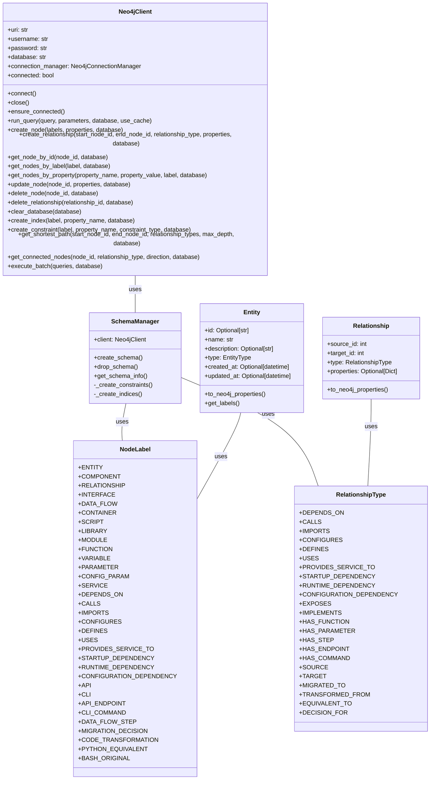

# Knowledge Graph Module

The Knowledge Graph module (`llm_stack.knowledge_graph`) provides integration with Neo4j for the LOCAL-LLM-STACK-RELOADED project, serving as a central knowledge base for autonomous AI Coding Agents.

## Overview

The Knowledge Graph module enables the capture, storage, and querying of information about the migration process from Bash to Python. It tracks migration decisions, code transformations, and the relationships between original Bash files and their Python equivalents.

## Architecture



## Components

The Knowledge Graph module consists of the following components:

1. **Neo4j Database**: Stores the Knowledge Graph.
2. **Client Library**: Connects to the Neo4j database and provides basic operations.
3. **Schema Manager**: Defines and manages the schema of the Knowledge Graph.
4. **Models**: Defines data models for entities in the Knowledge Graph.
5. **CLI Commands**: Enables interaction with the Knowledge Graph via the command line.

## API Reference

### Client API

The `Neo4jClient` class provides methods for interacting with the Neo4j database.

#### Initialization

```python
from llm_stack.knowledge_graph.client import Neo4jClient, get_client

# Create a new client with custom parameters
client = Neo4jClient(
    uri="bolt://localhost:7687",
    username="neo4j",
    password="password",
    database="neo4j"
)

# Or get the singleton instance
client = get_client()
```

#### Connection Management

```python
# Connect to the database
client.connect()

# Ensure connection exists
if client.ensure_connected():
    # Perform operations
    pass

# Close the connection
client.close()
```

#### Node Operations

```python
# Create a node
node = client.create_node(
    labels=["Person"],
    properties={"name": "John Doe", "age": 30}
)

# Get a node by ID
node = client.get_node_by_id(node_id)

# Get nodes by label
nodes = client.get_nodes_by_label("Person")

# Get nodes by property
nodes = client.get_nodes_by_property("name", "John Doe")

# Update a node
updated_node = client.update_node(node_id, {"age": 31})

# Delete a node
client.delete_node(node_id)
```

#### Relationship Operations

```python
# Create a relationship
relationship = client.create_relationship(
    start_node_id=person_id,
    end_node_id=company_id,
    relationship_type="WORKS_AT",
    properties={"since": 2020, "position": "Developer"}
)

# Delete a relationship
client.delete_relationship(relationship_id)
```

#### Query Execution

```python
# Execute a Cypher query
result = client.run_query(
    query="MATCH (n:Person) WHERE n.name = $name RETURN n",
    parameters={"name": "John Doe"}
)

# Execute multiple queries as a batch
results = client.execute_batch([
    ("MATCH (n:Person) WHERE n.name = $name RETURN n", {"name": "John Doe"}),
    ("MATCH (n:Company) WHERE n.name = $name RETURN n", {"name": "Acme Inc."})
])
```

#### Path Finding

```python
# Find the shortest path between two nodes
path = client.get_shortest_path(
    start_node_id=person_id,
    end_node_id=company_id,
    relationship_types=["WORKS_AT", "OWNS"],
    max_depth=3
)

# Get connected nodes
connected_nodes = client.get_connected_nodes(
    node_id=person_id,
    relationship_type="WORKS_AT",
    direction="OUTGOING"
)
```

#### Schema Operations

```python
# Create an index
client.create_index("Person", "name")

# Create a constraint
client.create_constraint("Person", "name", "UNIQUE")
```

#### Database Management

```python
# Clear the database
client.clear_database()
```

### Schema API

The `SchemaManager` class provides methods for managing the schema of the Knowledge Graph.

#### Initialization

```python
from llm_stack.knowledge_graph.schema import SchemaManager
from llm_stack.knowledge_graph.client import get_client

# Create a new schema manager with a custom client
client = get_client()
schema_manager = SchemaManager(client)

# Or use the default client
schema_manager = SchemaManager()
```

#### Schema Management

```python
# Create the schema
schema_manager.create_schema()

# Drop the schema
schema_manager.drop_schema()

# Get schema information
schema_info = schema_manager.get_schema_info()
```

#### Schema Initialization

```python
from llm_stack.knowledge_graph.schema import init_knowledge_graph

# Initialize the Knowledge Graph with schema and data
init_knowledge_graph(
    schema_file_path="path/to/schema.jsonld",
    graph_file_path="path/to/graph.jsonld"
)
```

### Models API

The Knowledge Graph module provides Pydantic models for entities in the Knowledge Graph.

#### Entity Models

```python
from llm_stack.knowledge_graph.models import (
    Entity, Component, Container, Script, Library, Module,
    Function, Variable, Parameter, ConfigParam, Service,
    Interface, API, CLI, APIEndpoint, CLICommand,
    DataFlow, DataFlowStep, MigrationDecision, CodeTransformation,
    BashOriginal, PythonEquivalent
)

# Create an entity
entity = Entity(
    name="Example Entity",
    description="An example entity",
    type="Component"
)

# Create a component
component = Component(
    name="Example Component",
    description="An example component",
    file_path="path/to/file.py",
    version="1.0.0"
)

# Create a migration decision
decision = MigrationDecision(
    name="Migrate Function X",
    description="Decision to migrate Function X to Python",
    decision="Migrate Function X to Python",
    rationale="Better readability and maintainability",
    alternatives=["Keep as Bash", "Rewrite in Go"],
    impact="Improved maintainability and integration with other Python code"
)

# Create a code transformation
transformation = CodeTransformation(
    name="Function X Transformation",
    description="Transformation of Function X from Bash to Python",
    transformation_type="function_migration",
    before="bash_code_here",
    after="python_code_here"
)

# Create a Bash original
bash_original = BashOriginal(
    name="example.sh",
    description="Original Bash script",
    file_path="path/to/example.sh",
    content="bash_content_here"
)

# Create a Python equivalent
python_equivalent = PythonEquivalent(
    name="example.py",
    description="Python equivalent of example.sh",
    file_path="path/to/example.py",
    content="python_content_here"
)
```

#### Relationship Model

```python
from llm_stack.knowledge_graph.models import Relationship
from llm_stack.knowledge_graph.schema import RelationshipType

# Create a relationship
relationship = Relationship(
    source_id=1,
    target_id=2,
    type=RelationshipType.EQUIVALENT_TO,
    properties={"since": "2023-01-01"}
)
```

#### Model Utilities

```python
from llm_stack.knowledge_graph.models import create_entity_model, neo4j_to_entity_model
from llm_stack.knowledge_graph.models import EntityType

# Create an entity model based on type
entity = create_entity_model(
    entity_type=EntityType.COMPONENT,
    name="Example Component",
    description="An example component",
    file_path="path/to/file.py",
    version="1.0.0"
)

# Convert a Neo4j node to an entity model
neo4j_node = {
    "labels": ["Entity", "Component"],
    "properties": {
        "name": "Example Component",
        "description": "An example component",
        "file_path": "path/to/file.py",
        "version": "1.0.0"
    }
}
entity = neo4j_to_entity_model(neo4j_node)
```

## Usage Examples

### Recording Migration Decisions

```python
from llm_stack.knowledge_graph.client import get_client
from llm_stack.knowledge_graph.models import MigrationDecision, BashOriginal, PythonEquivalent
from llm_stack.knowledge_graph.schema import RelationshipType

# Get the client
client = get_client()

# Create a Bash original
bash_original = BashOriginal(
    name="example.sh",
    description="Original Bash script",
    file_path="path/to/example.sh",
    content="bash_content_here"
)
bash_node = client.create_node(
    bash_original.get_labels(),
    bash_original.to_neo4j_properties()
)

# Create a Python equivalent
python_equivalent = PythonEquivalent(
    name="example.py",
    description="Python equivalent of example.sh",
    file_path="path/to/example.py",
    content="python_content_here"
)
python_node = client.create_node(
    python_equivalent.get_labels(),
    python_equivalent.to_neo4j_properties()
)

# Create a migration decision
decision = MigrationDecision(
    name="Migrate Function X",
    description="Decision to migrate Function X to Python",
    decision="Migrate Function X to Python",
    rationale="Better readability and maintainability",
    alternatives=["Keep as Bash", "Rewrite in Go"],
    impact="Improved maintainability and integration with other Python code"
)
decision_node = client.create_node(
    decision.get_labels(),
    decision.to_neo4j_properties()
)

# Create relationships
client.create_relationship(
    bash_node["id"],
    python_node["id"],
    RelationshipType.EQUIVALENT_TO,
    {"created_at": "2023-01-01"}
)

client.create_relationship(
    decision_node["id"],
    bash_node["id"],
    RelationshipType.DECISION_FOR,
    {"created_at": "2023-01-01"}
)
```

### Recording Code Transformations

```python
from llm_stack.knowledge_graph.client import get_client
from llm_stack.knowledge_graph.models import CodeTransformation
from llm_stack.knowledge_graph.schema import RelationshipType

# Get the client
client = get_client()

# Create a code transformation
transformation = CodeTransformation(
    name="Function X Transformation",
    description="Transformation of Function X from Bash to Python",
    transformation_type="function_migration",
    before="bash_code_here",
    after="python_code_here"
)
transformation_node = client.create_node(
    transformation.get_labels(),
    transformation.to_neo4j_properties()
)

# Create relationships
client.create_relationship(
    transformation_node["id"],
    bash_node["id"],
    RelationshipType.TRANSFORMED_FROM,
    {"created_at": "2023-01-01"}
)

client.create_relationship(
    python_node["id"],
    transformation_node["id"],
    RelationshipType.TRANSFORMED_FROM,
    {"created_at": "2023-01-01"}
)
```

### Querying the Knowledge Graph

```python
from llm_stack.knowledge_graph.client import get_client

# Get the client
client = get_client()

# Get all migration decisions
decisions = client.get_nodes_by_label("MigrationDecision")

# Get all code transformations for a specific Bash file
query = """
MATCH (t:CodeTransformation)-[:TRANSFORMED_FROM]->(b:BashOriginal)
WHERE b.file_path = $file_path
RETURN t, b
"""
transformations = client.run_query(
    query,
    {"file_path": "path/to/example.sh"}
)

# Get all Python equivalents for a specific Bash file
query = """
MATCH (p:PythonEquivalent)-[:EQUIVALENT_TO]->(b:BashOriginal)
WHERE b.file_path = $file_path
RETURN p, b
"""
equivalents = client.run_query(
    query,
    {"file_path": "path/to/example.sh"}
)
```

## Configuration

The Knowledge Graph module can be configured using environment variables:

- `NEO4J_URI`: URI of the Neo4j database (default: "bolt://localhost:7687")
- `NEO4J_USERNAME`: Username for the Neo4j database (default: "neo4j")
- `NEO4J_PASSWORD`: Password for the Neo4j database (default: "password")
- `NEO4J_DATABASE`: Name of the Neo4j database to use (default: "neo4j")
- `HOST_PORT_NEO4J_HTTP`: HTTP port for the Neo4j browser (default: 7474)
- `HOST_PORT_NEO4J_BOLT`: Bolt port for the Neo4j database (default: 7687)
- `HOST_PORT_NEO4J_HTTPS`: HTTPS port for the Neo4j browser (default: 7473)
- `NEO4J_CPU_LIMIT`: CPU limit for the Neo4j container (default: 0.5)
- `NEO4J_MEMORY_LIMIT`: Memory limit for the Neo4j container (default: 4G)
- `NEO4J_HEAP_INITIAL`: Initial heap size for Neo4j (default: 512M)
- `NEO4J_HEAP_MAX`: Maximum heap size for Neo4j (default: 2G)
- `NEO4J_PAGECACHE`: Size of the page cache for Neo4j (default: 512M)

## CLI Commands

The Knowledge Graph module provides CLI commands for interacting with the Knowledge Graph:

```bash
# Start the Knowledge Graph module
llm start --with knowledge_graph

# Check the status of the Knowledge Graph module
llm kg status

# Show migration statistics
llm kg stats

# Record a migration decision
llm kg record-decision --decision "Migrate Function X to Python" --rationale "Better readability and maintainability" --bash-file "path/to/bash/file.sh" --python-file "path/to/python/file.py"

# Record a code transformation
llm kg record-transformation --type "function_migration" --before "bash_code_here" --after "python_code_here" --bash-file "path/to/bash/file.sh" --python-file "path/to/python/file.py"

# Record a Bash file
llm kg record-bash-file --file-path "path/to/bash/file.sh" --content-file "path/to/content/file.sh"

# Record a Python file
llm kg record-python-file --file-path "path/to/python/file.py" --content-file "path/to/content/file.py" --bash-file "path/to/bash/file.sh"

# Get migration decisions for a Bash file
llm kg get-decisions --bash-file "path/to/bash/file.sh"

# Get code transformations for a Bash file
llm kg get-transformations --bash-file "path/to/bash/file.sh"

# Get the status of a file
llm kg get-file-status --bash-file "path/to/bash/file.sh"
```

## Neo4j Browser

The Neo4j browser is available at http://localhost:7474. The default credentials are:

- Username: neo4j
- Password: password

In the browser, you can execute Cypher queries to explore and visualize the Knowledge Graph.

### Example Cypher Queries

Show all migration decisions:

```cypher
MATCH (d:MigrationDecision)
RETURN d
```

Show all code transformations for a specific Bash file:

```cypher
MATCH (t:CodeTransformation)-[:TRANSFORMED_FROM]->(b:BashOriginal)
WHERE b.file_path = "path/to/bash/file.sh"
RETURN t, b
```

Show relationships between Bash and Python files:

```cypher
MATCH (p:PythonEquivalent)-[:EQUIVALENT_TO]->(b:BashOriginal)
RETURN p, b
```

## Error Handling

The Knowledge Graph module uses the `error` module from `llm_stack.core` for error handling. The following error types are used:

- `error.DatabaseError`: Raised when an error occurs during database operations.

Example:

```python
from llm_stack.core import error
from llm_stack.knowledge_graph.client import get_client

client = get_client()

try:
    client.run_query("INVALID QUERY")
except error.DatabaseError as e:
    print(f"Database error: {str(e)}")
```

## Limitations and Constraints

- The Knowledge Graph module requires a running Neo4j database.
- The module is designed for tracking migration decisions and code transformations, not for general-purpose graph operations.
- The module does not support distributed transactions or sharding.
- The module does not support Neo4j's full-text search capabilities.
- The module does not support Neo4j's spatial capabilities.