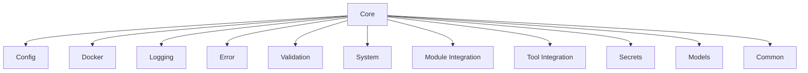
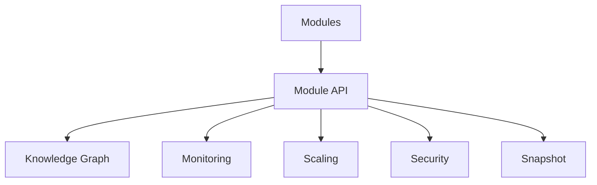
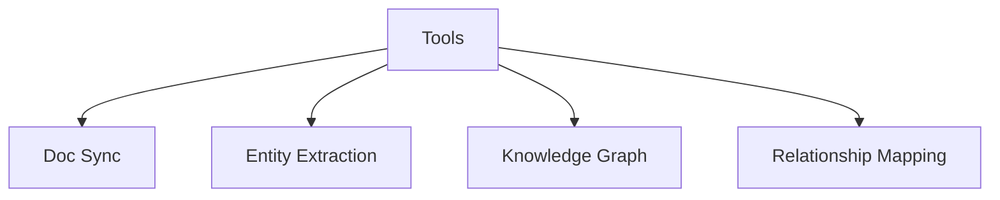
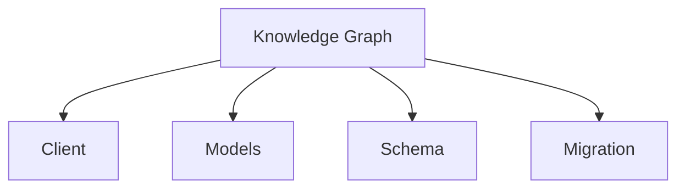
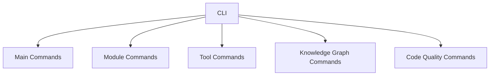

# LOCAL-LLM-STACK-RELOADED Specification Manifest

## 1. Project Overview

### 1.1 Purpose and Scope
LOCAL-LLM-STACK-RELOADED is a complete Python-based reimplementation of the original Bash-based LOCAL-LLM-STACK. It maintains all functionality of the original while implementing modern Python best practices and design patterns. The system enables easy deployment and management of local Large Language Model (LLM) services using Docker containers.

### 1.2 Key Architectural Principles
- **Modularity**: Clear separation of concerns with well-defined components
- **Extensibility**: Easy addition of new modules and tools
- **Maintainability**: Consistent code structure and documentation
- **Testability**: Comprehensive test coverage
- **Dependency Injection**: Loose coupling between components
- **Interface-Based Design**: Clear contracts between components

### 1.3 Comparison with Original LOCAL-LLM-STACK
- **Implementation Language**: Python vs. Bash
- **Architecture**: Modular, object-oriented vs. procedural scripts
- **Error Handling**: Comprehensive exception handling vs. basic error checks
- **Testing**: Structured testing framework vs. minimal testing
- **Documentation**: Integrated docstrings and type hints vs. separate documentation
- **Knowledge Graph**: Neo4j-based knowledge representation (new feature)

## 2. Directory Structure

### 2.1 Top-Level Organization

```
LOCAL-LLM-STACK-RELOADED/
├── docs/                  # Project documentation
├── docker/                # Docker-related files
│   └── modules/           # Module-specific Docker files
├── examples/              # Example usage scripts
├── llm_stack/             # Main package
│   ├── cli_commands/      # CLI command implementations
│   ├── code_quality/      # Code quality tools
│   ├── core/              # Core functionality
│   ├── knowledge_graph/   # Knowledge graph functionality
│   ├── modules/           # Extensible modules
│   └── tools/             # Utility tools
├── tests/                 # Test suite
│   ├── fixtures/          # Test fixtures
│   ├── integration/       # Integration tests
│   └── unit/              # Unit tests
├── pyproject.toml         # Project configuration
├── setup.py               # Installation script
└── README.md              # Project overview
```

### 2.2 Component-Level Organization

#### 2.2.1 Core Component Structure
```
core/
├── __init__.py            # Package initialization
├── common.py              # Common utilities
├── config.py              # Configuration management
├── docker.py              # Docker integration
├── error.py               # Error handling
├── logging.py             # Logging functionality
├── models.py              # Data models
├── module_integration.py  # Module integration
├── secrets.py             # Secrets management
├── system.py              # System operations
├── tool_integration.py    # Tool integration
└── validation.py          # Validation utilities
```

#### 2.2.2 Module Structure
```
modules/
├── __init__.py            # Package initialization
├── module_api.py          # Module API definition
├── knowledge_graph/       # Knowledge graph module
├── monitoring/            # Monitoring module
├── scaling/               # Scaling module
├── security/              # Security module
└── snapshot/              # Snapshot module
```

#### 2.2.3 Tool Structure
```
tools/
├── __init__.py            # Package initialization
├── doc_sync/              # Documentation synchronization
├── entity_extraction/     # Entity extraction
├── knowledge_graph/       # Knowledge graph tools
└── relationship_mapping/  # Relationship mapping
```

#### 2.2.4 Test Structure
```
tests/
├── __init__.py            # Package initialization
├── fixtures/              # Test fixtures
│   └── __init__.py
├── integration/           # Integration tests
│   └── __init__.py
└── unit/                  # Unit tests
    ├── __init__.py
    ├── core/              # Core component tests
    └── knowledge_graph/   # Knowledge graph tests
```

### 2.3 Standardized Directory Patterns

Each module and tool should follow this structure:
```
module_name/
├── __init__.py            # Package initialization
├── module.py              # Main module implementation
├── commands.py            # CLI commands (if applicable)
├── models.py              # Data models (if applicable)
└── README.md              # Module documentation
```

## 3. File Organization and Naming Conventions

### 3.1 Python Module Naming
- **Package Names**: Lowercase with underscores (snake_case)
- **Module Names**: Lowercase with underscores (snake_case)
- **Class Names**: CamelCase
- **Function Names**: Lowercase with underscores (snake_case)
- **Constant Names**: UPPERCASE with underscores
- **Variable Names**: Lowercase with underscores (snake_case)

### 3.2 Configuration Files
- **Environment Files**: `.env` for environment variables
- **Docker Compose Files**: `docker-compose.yml` or `<component>.yml`
- **Configuration Templates**: `<name>-template.<extension>`

### 3.3 Documentation Files
- **Markdown Files**: `<name>.md`
- **Diagram Files**: `<name>.mmd` for Mermaid diagrams
- **API Documentation**: Generated from docstrings

### 3.4 Test Files
- **Test Files**: `test_<module_name>.py`
- **Fixture Files**: Placed in `fixtures/` directory
- **Mock Data**: Placed in `fixtures/` directory

## 4. Component Architecture

### 4.1 Core Components



#### 4.1.1 Required Components
- **Config**: Configuration management
- **Docker**: Docker integration
- **Logging**: Logging functionality
- **Error**: Error handling
- **Validation**: Validation utilities
- **System**: System operations
- **Module Integration**: Module integration
- **Tool Integration**: Tool integration
- **Secrets**: Secrets management
- **Models**: Data models
- **Common**: Common utilities

#### 4.1.2 Component Responsibilities
- **Config**: Load, validate, and provide access to configuration
- **Docker**: Manage Docker containers and compose operations
- **Logging**: Provide consistent logging functionality
- **Error**: Define and handle errors
- **Validation**: Validate inputs and configurations
- **System**: Interact with the operating system
- **Module Integration**: Load and manage modules
- **Tool Integration**: Load and manage tools
- **Secrets**: Manage sensitive information
- **Models**: Define data structures
- **Common**: Provide common utilities

### 4.2 Modules



#### 4.2.1 Module API
Each module must implement the Module API defined in `module_api.py`:
- **initialize()**: Initialize the module
- **get_status()**: Get the module status
- **start()**: Start the module
- **stop()**: Stop the module
- **get_info()**: Get module information

#### 4.2.2 Module Types
- **Knowledge Graph**: Neo4j-based knowledge representation
- **Monitoring**: System monitoring
- **Scaling**: Scaling functionality
- **Security**: Security features
- **Snapshot**: System snapshot functionality

### 4.3 Tools



#### 4.3.1 Tool Integration
Each tool must implement the Tool API:
- **initialize()**: Initialize the tool
- **execute()**: Execute the tool
- **get_info()**: Get tool information

#### 4.3.2 Tool Types
- **Doc Sync**: Documentation synchronization
- **Entity Extraction**: Entity extraction from code
- **Knowledge Graph**: Knowledge graph generation
- **Relationship Mapping**: Relationship mapping between components

### 4.4 Knowledge Graph



#### 4.4.1 Components
- **Client**: Neo4j client
- **Models**: Data models for knowledge graph
- **Schema**: Schema definition
- **Migration**: Migration functionality

#### 4.4.2 Responsibilities
- **Client**: Connect to Neo4j and execute queries
- **Models**: Define data structures for knowledge graph
- **Schema**: Define schema for knowledge graph
- **Migration**: Migrate data between versions

### 4.5 CLI Commands



#### 4.5.1 Command Types
- **Main Commands**: Core functionality (start, stop, status)
- **Module Commands**: Module-specific commands
- **Tool Commands**: Tool-specific commands
- **Knowledge Graph Commands**: Knowledge graph commands
- **Code Quality Commands**: Code quality commands

## 5. Interface Definitions

### 5.1 Component Interfaces

#### 5.1.1 Module Interface
```python
class ModuleInterface:
    """Interface for modules."""
    
    def initialize(self) -> bool:
        """Initialize the module."""
        pass
    
    def get_status(self) -> dict:
        """Get the module status."""
        pass
    
    def start(self) -> bool:
        """Start the module."""
        pass
    
    def stop(self) -> bool:
        """Stop the module."""
        pass
    
    def get_info(self) -> dict:
        """Get module information."""
        pass
```

#### 5.1.2 Tool Interface
```python
class ToolInterface:
    """Interface for tools."""
    
    def initialize(self) -> bool:
        """Initialize the tool."""
        pass
    
    def execute(self, **kwargs) -> dict:
        """Execute the tool."""
        pass
    
    def get_info(self) -> dict:
        """Get tool information."""
        pass
```

### 5.2 Dependency Injection

Components should use dependency injection to reduce coupling:

```python
class Module:
    """Example module with dependency injection."""
    
    def __init__(self, logger=None, config=None):
        """Initialize the module with dependencies."""
        self.logger = logger or logging.get_logger()
        self.config = config or config.get_config()
```

### 5.3 Event System

Components should use an event system for communication:

```python
class EventEmitter:
    """Event emitter for component communication."""
    
    def __init__(self):
        """Initialize the event emitter."""
        self.listeners = {}
    
    def on(self, event, callback):
        """Register a callback for an event."""
        if event not in self.listeners:
            self.listeners[event] = []
        self.listeners[event].append(callback)
    
    def emit(self, event, *args, **kwargs):
        """Emit an event."""
        if event in self.listeners:
            for callback in self.listeners[event]:
                callback(*args, **kwargs)
```

## 6. Migration Patterns

### 6.1 Bash to Python Migration

#### 6.1.1 Function Migration
- **Bash Function**: Shell function with positional parameters
- **Python Function**: Python function with named parameters and type hints

Example:
```bash
# Bash
function check_config() {
    local config_file="$1"
    if [ ! -f "$config_file" ]; then
        echo "Error: Config file not found"
        return 1
    fi
    return 0
}
```

```python
# Python
def check_config(config_file: str) -> bool:
    """
    Check if a configuration file exists.
    
    Args:
        config_file: Path to the configuration file
        
    Returns:
        bool: True if the file exists, False otherwise
    """
    if not os.path.isfile(config_file):
        logging.error(f"Error: Config file not found: {config_file}")
        return False
    return True
```

#### 6.1.2 Script Migration
- **Bash Script**: Procedural script with global variables
- **Python Script**: Object-oriented script with classes and methods

#### 6.1.3 Error Handling Migration
- **Bash Error Handling**: Return codes and error messages
- **Python Error Handling**: Exceptions and logging

#### 6.1.4 Configuration Migration
- **Bash Configuration**: Environment variables and config files
- **Python Configuration**: Environment variables, config files, and typed models

### 6.2 Knowledge Graph Integration

The knowledge graph should be used to track migration decisions and code transformations:

```python
# Record a migration decision
kg_module.record_migration_decision(
    decision="Migrate function X to Python",
    rationale="Better error handling and type safety",
    bash_file_path="path/to/bash/file.sh",
    python_file_path="path/to/python/file.py"
)

# Record a code transformation
kg_module.record_code_transformation(
    transformation_type="function_migration",
    before="bash_code_here",
    after="python_code_here",
    bash_file_path="path/to/bash/file.sh",
    python_file_path="path/to/python/file.py"
)
```

## 7. Configuration Management Standards

### 7.1 Configuration Sources

#### 7.1.1 Environment Variables
- Environment variables should be used for configuration that varies between environments
- Environment variables should be loaded from `.env` files
- Environment variables should be validated against a schema

#### 7.1.2 Configuration Files
- Configuration files should be used for complex configuration
- Configuration files should be in YAML or JSON format
- Configuration files should be validated against a schema

#### 7.1.3 Default Configuration
- Default configuration should be defined in code
- Default configuration should be overridden by environment variables and configuration files

### 7.2 Configuration Access

#### 7.2.1 Configuration Module
- A central configuration module should provide access to all configuration
- The configuration module should validate configuration
- The configuration module should provide typed access to configuration

```python
# Example configuration access
from llm_stack.core import config

# Get a configuration value with a default
db_host = config.get_config("DB_HOST", "localhost")

# Get a typed configuration value
db_port = config.get_config_int("DB_PORT", 5432)

# Get a configuration section
db_config = config.get_config_section("database")
```

#### 7.2.2 Configuration Models
- Configuration should be represented as typed models
- Configuration models should validate configuration
- Configuration models should provide default values

```python
# Example configuration model
from pydantic import BaseModel, Field

class DatabaseConfig(BaseModel):
    """Database configuration."""
    
    host: str = Field(default="localhost", description="Database host")
    port: int = Field(default=5432, description="Database port")
    username: str = Field(..., description="Database username")
    password: str = Field(..., description="Database password")
    database: str = Field(..., description="Database name")
```

### 7.3 Secrets Management

#### 7.3.1 Secrets Storage
- Secrets should be stored in a secure location
- Secrets should not be committed to version control
- Secrets should be loaded from environment variables or secure storage

#### 7.3.2 Secrets Generation
- Secrets should be generated securely
- Secrets should be rotated regularly
- Secrets should be backed up securely

## 8. CLI Command Structure Standards

### 8.1 Command Organization

#### 8.1.1 Command Groups
- Commands should be organized into logical groups
- Command groups should be defined in separate modules
- Command groups should be registered with the main CLI

```python
# Example command group
@click.group(name="codeqa")
def codeqa_cli():
    """Code Quality commands."""
    pass

@codeqa_cli.command(name="run")
@click.argument("path", type=click.Path(exists=True))
@click.option("--recursive", "-r", is_flag=True, help="Recursively process all Python files")
def run_command(path, recursive):
    """Run code quality checks on a file or directory."""
    pass
```

#### 8.1.2 Command Naming
- Command names should be lowercase with hyphens
- Command names should be descriptive
- Command names should be consistent across the CLI

### 8.2 Command Implementation

#### 8.2.1 Command Functions
- Command functions should be defined in a `commands.py` file
- Command functions should use Click decorators
- Command functions should have descriptive docstrings

#### 8.2.2 Command Arguments and Options
- Command arguments should be required parameters
- Command options should be optional parameters
- Command options should have short and long forms
- Command options should have descriptive help text

#### 8.2.3 Command Output
- Command output should use the logging system
- Command output should be consistent across commands
- Command output should be user-friendly

### 8.3 Command Registration

#### 8.3.1 Main CLI
- Command groups should be registered with the main CLI
- Command registration should be done in the main CLI file
- Command registration should be done at the end of the file

```python
# Example command registration
from llm_stack.code_quality import codeqa_cli
from llm_stack.modules.knowledge_graph.module import kg_cli

main.add_command(codeqa_cli)
main.add_command(kg_cli)
```

## 9. Code Standards

### 9.1 PEP 8 Compliance
- Code should follow PEP 8 style guide
- Code should be formatted with Black
- Imports should be sorted with isort
- Code should be checked with flake8

### 9.2 Design Patterns

#### 9.2.1 Singleton Pattern
- Singleton pattern should be used for module instances
- Singleton pattern should be implemented with a module-level instance
- Singleton pattern should be accessed through a getter function

```python
# Example singleton pattern
class Module:
    """Example module with singleton pattern."""
    
    def __init__(self):
        """Initialize the module."""
        pass

# Module-level instance
_module = None

def get_module():
    """Get the module instance."""
    global _module
    if _module is None:
        _module = Module()
    return _module
```

#### 9.2.2 Factory Pattern
- Factory pattern should be used for creating objects
- Factory pattern should be implemented with a factory function
- Factory pattern should be used for dependency injection

```python
# Example factory pattern
def create_logger(name):
    """Create a logger."""
    logger = logging.getLogger(name)
    logger.setLevel(logging.INFO)
    return logger
```

#### 9.2.3 Strategy Pattern
- Strategy pattern should be used for interchangeable algorithms
- Strategy pattern should be implemented with interfaces
- Strategy pattern should be used for extensibility

```python
# Example strategy pattern
class ValidationStrategy:
    """Interface for validation strategies."""
    
    def validate(self, value):
        """Validate a value."""
        pass

class RequiredValidator(ValidationStrategy):
    """Validator that checks if a value is not None."""
    
    def validate(self, value):
        """Validate that a value is not None."""
        return value is not None

class TypeValidator(ValidationStrategy):
    """Validator that checks if a value is of a specific type."""
    
    def __init__(self, expected_type):
        """Initialize the validator with an expected type."""
        self.expected_type = expected_type
    
    def validate(self, value):
        """Validate that a value is of the expected type."""
        return isinstance(value, self.expected_type)
```

### 9.3 Error Handling

#### 9.3.1 Exception Hierarchy
- Exceptions should be organized in a hierarchy
- Exceptions should be defined in an `error.py` file
- Exceptions should have descriptive names and messages

```python
# Example exception hierarchy
class LLMStackError(Exception):
    """Base exception for all LLM Stack errors."""
    pass

class ConfigError(LLMStackError):
    """Exception raised for configuration errors."""
    pass

class DockerError(LLMStackError):
    """Exception raised for Docker-related errors."""
    pass
```

#### 9.3.2 Exception Handling
- Exceptions should be caught at the appropriate level
- Exceptions should be logged with context
- Exceptions should be converted to user-friendly messages

```python
# Example exception handling
try:
    config.load_config()
except ConfigError as e:
    logging.error(f"Failed to load configuration: {str(e)}")
    sys.exit(1)
```

### 9.4 Logging Standards

#### 9.4.1 Logging Levels
- DEBUG: Detailed information for debugging
- INFO: General information about program execution
- WARNING: Potential issues that don't prevent execution
- ERROR: Errors that prevent a function from completing
- CRITICAL: Critical errors that prevent the program from continuing

#### 9.4.2 Logging Format
- Logs should include timestamp, level, module, and message
- Logs should be formatted consistently
- Logs should be colorized for better readability

```python
# Example logging configuration
logging.basicConfig(
    level=logging.INFO,
    format="%(asctime)s - %(levelname)s - %(module)s - %(message)s",
    datefmt="%Y-%m-%d %H:%M:%S"
)
```

## 10. Documentation Standards

### 10.1 Code Documentation

#### 10.1.1 Docstrings
- All modules, classes, and functions should have docstrings
- Docstrings should follow Google style
- Docstrings should include parameters, return values, and exceptions

```python
# Example docstring
def validate_config(config_file: str) -> bool:
    """
    Validate a configuration file.
    
    Args:
        config_file: Path to the configuration file
        
    Returns:
        bool: True if the configuration is valid, False otherwise
        
    Raises:
        ConfigError: If the configuration file is invalid
    """
    pass
```

#### 10.1.2 Type Hints
- All functions should have type hints
- Type hints should be used for parameters and return values
- Type hints should use the typing module for complex types

```python
# Example type hints
from typing import Dict, List, Optional, Union

def get_config(key: str, default: Optional[str] = None) -> Optional[str]:
    """Get a configuration value."""
    pass

def get_config_section(section: str) -> Dict[str, Union[str, int, bool]]:
    """Get a configuration section."""
    pass
```

#### 10.1.3 Comments
- Comments should explain why, not what
- Comments should be used sparingly
- Comments should be kept up-to-date

### 10.2 User Documentation

#### 10.2.1 README
- README should provide an overview of the project
- README should include installation instructions
- README should include basic usage examples

#### 10.2.2 User Guide
- User guide should provide detailed usage instructions
- User guide should include examples
- User guide should be organized by task

#### 10.2.3 Command Reference
- Command reference should document all CLI commands
- Command reference should include arguments and options
- Command reference should include examples

### 10.3 Architecture Documentation

#### 10.3.1 Architecture Overview
- Architecture overview should describe the system architecture
- Architecture overview should include diagrams
- Architecture overview should explain design decisions

#### 10.3.2 Component Documentation
- Component documentation should describe each component
- Component documentation should include responsibilities
- Component documentation should include interfaces

#### 10.3.3 API Documentation
- API documentation should describe all public APIs
- API documentation should include parameters and return values
- API documentation should include examples

## 11. Testing Structure

### 11.1 Unit Testing

#### 11.1.1 Test Organization
- Tests should be organized by module
- Tests should be in a `tests/unit` directory
- Tests should follow the same structure as the code

#### 11.1.2 Test Naming
- Test files should be named `test_<module_name>.py`
- Test functions should be named `test_<function_name>`
- Test classes should be named `Test<ClassName>`

#### 11.1.3 Test Coverage
- Tests should cover all public functions
- Tests should cover edge cases
- Tests should cover error cases

### 11.2 Integration Testing

#### 11.2.1 Test Organization
- Tests should be organized by feature
- Tests should be in a `tests/integration` directory
- Tests should test interactions between components

#### 11.2.2 Test Naming
- Test files should be named `test_<feature_name>.py`
- Test functions should be named `test_<scenario>`
- Test classes should be named `Test<FeatureName>`

#### 11.2.3 Test Coverage
- Tests should cover all features
- Tests should cover common scenarios
- Tests should cover error scenarios

### 11.3 Fixtures and Mocks

#### 11.3.1 Fixtures
- Fixtures should be used for test setup and teardown
- Fixtures should be in a `tests/fixtures` directory
- Fixtures should be reusable across tests

```python
# Example fixture
@pytest.fixture
def config_file():
    """Create a temporary configuration file."""
    with tempfile.NamedTemporaryFile(mode="w", suffix=".yaml") as f:
        f.write("key: value\n")
        f.flush()
        yield f.name
```

#### 11.3.2 Mocks
- Mocks should be used for external dependencies
- Mocks should be created with unittest.mock
- Mocks should be used to isolate the code under test

```python
# Example mock
@patch("llm_stack.core.docker.client")
def test_docker_compose_up(mock_client):
    """Test docker_compose_up function."""
    mock_client.containers.run.return_value = {"Id": "container_id"}
    result = docker.compose_up("project", "compose_file", "service")
    assert result is True
    mock_client.containers.run.assert_called_once()
```

## 12. Inconsistencies and Recommendations

### 12.1 Identified Structural Issues

#### 12.1.1 Inconsistent Module Structure
- Some modules follow different patterns
- Some modules lack proper initialization
- Some modules have inconsistent naming

#### 12.1.2 Incomplete Interface Definitions
- Some interfaces are not fully defined
- Some interfaces lack proper documentation
- Some interfaces are not consistently implemented

#### 12.1.3 Missing Tests
- Some components lack unit tests
- Some components lack integration tests
- Some tests lack proper assertions

### 12.2 Deviations from Best Practices

#### 12.2.1 Inconsistent Error Handling
- Some components use return codes instead of exceptions
- Some components don't properly log errors
- Some components don't provide user-friendly error messages

#### 12.2.2 Inconsistent Configuration Management
- Some components access environment variables directly
- Some components don't validate configuration
- Some components don't provide defaults for missing configuration

#### 12.2.3 Inconsistent Documentation
- Some components lack proper docstrings
- Some components lack type hints
- Some components lack user documentation

### 12.3 Recommendations for Improvement

#### 12.3.1 Standardize Module Structure
- Define a clear module template
- Ensure all modules follow the template
- Provide a module creation tool

#### 12.3.2 Complete Interface Definitions
- Define clear interfaces for all components
- Document all interfaces
- Ensure all components implement the appropriate interfaces

#### 12.3.3 Improve Test Coverage
- Add unit tests for all components
- Add integration tests for all features
- Ensure all tests have proper assertions

#### 12.3.4 Standardize Error Handling
- Use exceptions consistently
- Log all errors with context
- Provide user-friendly error messages

#### 12.3.5 Standardize Configuration Management
- Use the configuration module consistently
- Validate all configuration
- Provide defaults for missing configuration

#### 12.3.6 Improve Documentation
- Add docstrings to all components
- Add type hints to all functions
- Add user documentation for all features

## 13. Component Relationship Matrix

| Component          | Depends On                                      | Used By                                        |
|--------------------|------------------------------------------------|------------------------------------------------|
| Core               | -                                              | CLI, Modules, Tools, Knowledge Graph           |
| Config             | -                                              | Core, CLI, Modules, Tools, Knowledge Graph     |
| Docker             | Config                                         | Core, CLI, Modules                             |
| Logging            | Config                                         | Core, CLI, Modules, Tools, Knowledge Graph     |
| Error              | Logging                                        | Core, CLI, Modules, Tools, Knowledge Graph     |
| Validation         | Logging, Error                                 | Core, CLI, Modules, Tools, Knowledge Graph     |
| System             | Logging, Error                                 | Core, CLI, Modules, Tools                      |
| Module Integration | Logging, Error, Config                         | Core, CLI                                      |
| Tool Integration   | Logging, Error, Config                         | Core, CLI                                      |
| Secrets            | Logging, Error, Config                         | Core, CLI, Modules                             |
| Models             | -                                              | Core, CLI, Modules, Tools, Knowledge Graph     |
| Common             | -                                              | Core, CLI, Modules, Tools, Knowledge Graph     |
| CLI                | Core, Modules, Tools, Knowledge Graph          | -                                              |
| Modules            | Core                                           | CLI                                            |
| Tools              | Core                                           | CLI                                            |
| Knowledge Graph    | Core, Neo4j                                    | CLI, Modules, Tools                            |
| Code Quality       | Core, Knowledge Graph                          | CLI                                            |